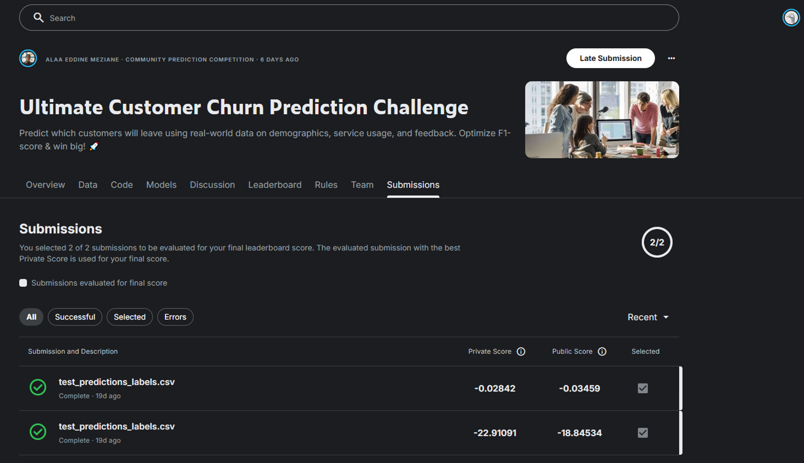

# Submissão para a Competição

Esta seção documenta a participação na competição Kaggle e os detalhes da submissão.

## Informações da Competição

- **Plataforma**: Kaggle
- **Nome**: Ultimate Customer Churn Prediction Challenge
- **Link**: [https://www.kaggle.com/competitions/ultimate-customer-churn-prediction-challenge](https://www.kaggle.com/competitions/ultimate-customer-churn-prediction-challenge)
- **Métrica Oficial**: **F1-score**
- **Tipo**: Late Submission (competição encerrada)

## Estrutura do Dataset

### Dados Fornecidos

- **train.csv**: 8.000 amostras com target `Churn`
- **test.csv**: 2.000 amostras sem target (para predição)
- **Colunas**: 17 features + target (apenas em train)

### Formato de Submissão

```csv
Customer_ID,Churn
9001,0
9002,1
9003,0
...
```

**Requisitos**:
- Arquivo CSV com exatamente 2.000 linhas (+ header)
- Coluna `Customer_ID` deve corresponder ao test.csv
- Coluna `Churn` deve conter previsões binárias (0 ou 1)

## Pipeline de Submissão

### 1. Pré-processamento do Teste

```python
import pickle
from sklearn.compose import ColumnTransformer

# Carregar preprocessor treinado
with open('notebooks/artifacts/preprocessor.pkl', 'rb') as f:
    preprocessor = pickle.load(f)

# Aplicar no teste
X_test = test[feature_vars]
X_test_transformed = preprocessor.transform(X_test)
```

### 2. Predição

```python
# Carregar modelo final (treinado em train+val)
with open('notebooks/artifacts/final_model_trainval.pkl', 'rb') as f:
    model = pickle.load(f)

# Predições
y_pred = model.predict(X_test_transformed)

# OU, se quiser usar probabilidades com threshold customizado:
y_proba = model.predict_proba(X_test_transformed)[:, 1]
y_pred = (y_proba >= 0.5).astype(int)  # threshold padrão
```

### 3. Gerar Submissão

```python
import pandas as pd

submission = pd.DataFrame({
    'Customer_ID': test['Customer_ID'],
    'Churn': y_pred
})

submission.to_csv('submission.csv', index=False)
print(f"Submissão gerada: {len(submission)} linhas")
```

## Detalhes da Submissão

### Threshold de Classificação

**Threshold utilizado**: 0.5 (padrão)

**Justificativa**:

- Split balanceado garante que probabilidades estejam centradas em 0.5
- Simplifica reprodução
- Não houve tempo para otimizar threshold no conjunto de validação

### Leaderboard

**Estrutura**:

- **Public Leaderboard**: 50% do test.csv (1.000 amostras)
- **Private Leaderboard**: 50% do test.csv (1.000 amostras) — usado para ranking final

**Métrica**: F1-score

!!! info "Status da Submissão"
    **Nota**: Esta seção será atualizada após a submissão oficial ser realizada.
    
    Para submeter:
    1. Acessar [página da competição](https://www.kaggle.com/competitions/ultimate-customer-churn-prediction-challenge)
    2. Fazer upload de `submission.csv`
    3. Aguardar processamento
    4. Verificar score no public leaderboard
    5. Adicionar screenshot e link do perfil aqui

## Bônus da Disciplina

Conforme rubrica do projeto:

| Pontos | Descrição |
|:------:|----------|
| +0.5 | Submissão válida em competição reconhecida (proof required) |
| +0.5 | Submissão válida rankando no top 50% do leaderboard |

Segue então, o URL de submissão e do leaderboard da [competição](https://www.kaggle.com/competitions/ultimate-customer-churn-prediction-challenge/leaderboard).

<figure markdown>
  
  <figcaption><strong>Figura 1 — Submissão competição</strong><br><em>Fonte: Produção Autoral</em></figcaption>
</figure>

<figure markdown>
  
  <figcaption><strong>Figura 2 — Ranking final da competição</strong><br><em>Fonte: Produção Autoral</em></figcaption>
</figure>

## Reprodutibilidade

### Modelo Utilizado

- **Arquivo**: `notebooks/artifacts/final_model_trainval.pkl`
- **Treinado em**: train + validation (4.260 amostras)
- **Hiperparâmetros**: Conforme seção "Implementação do MLP"
- **Random state**: 42