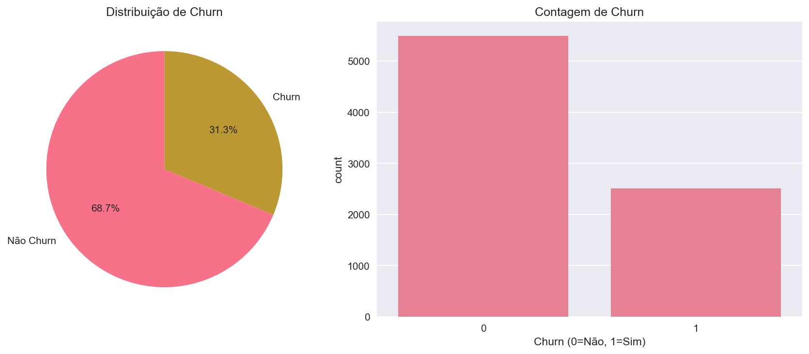
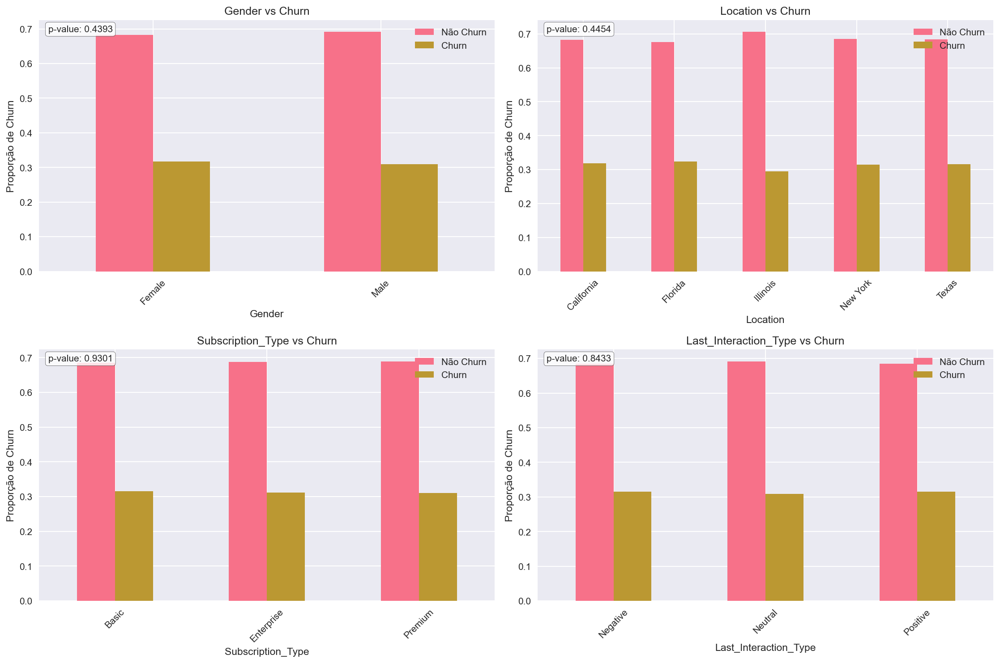
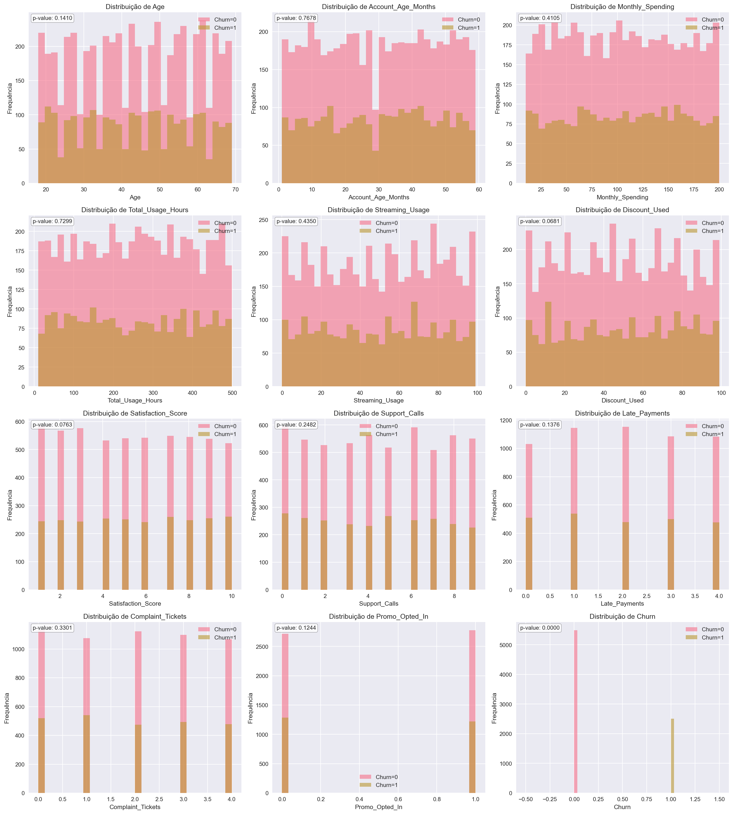
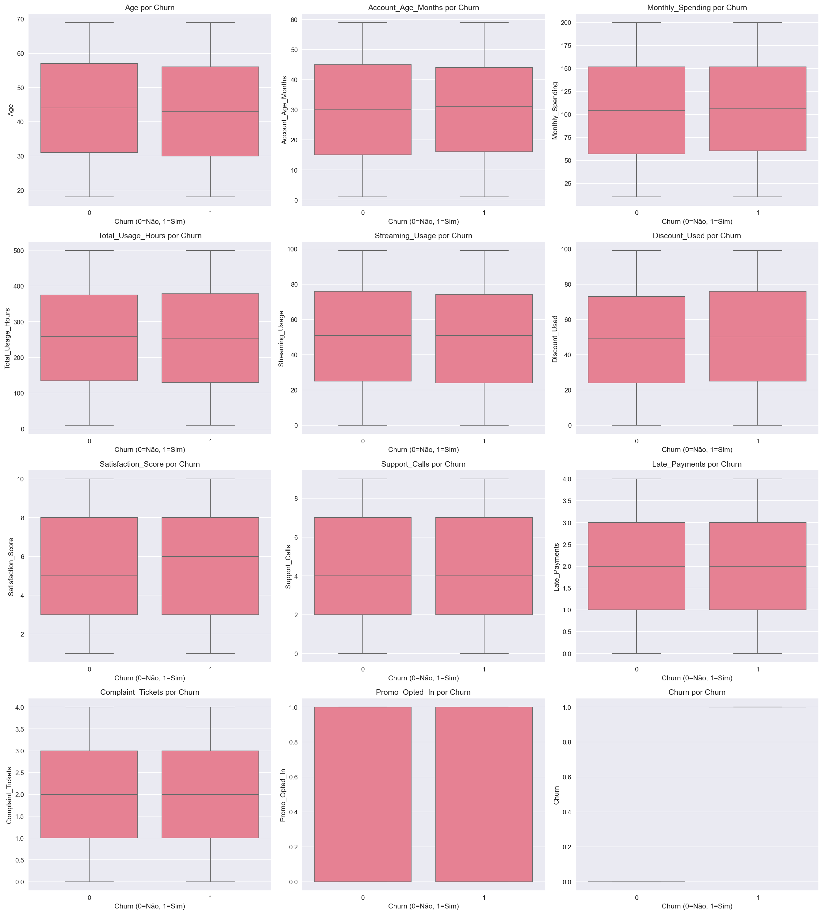
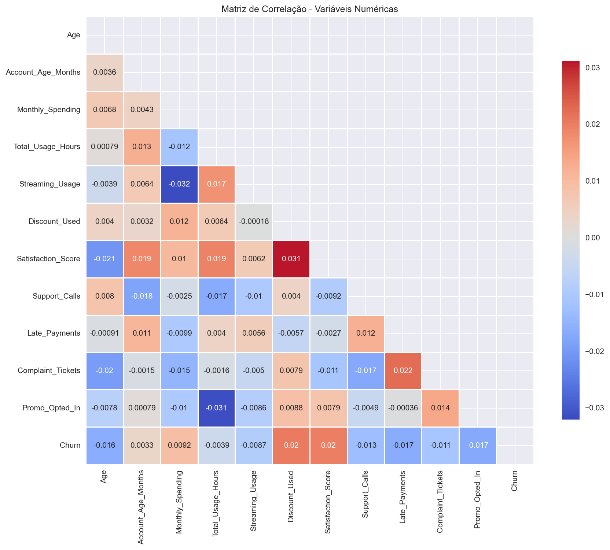
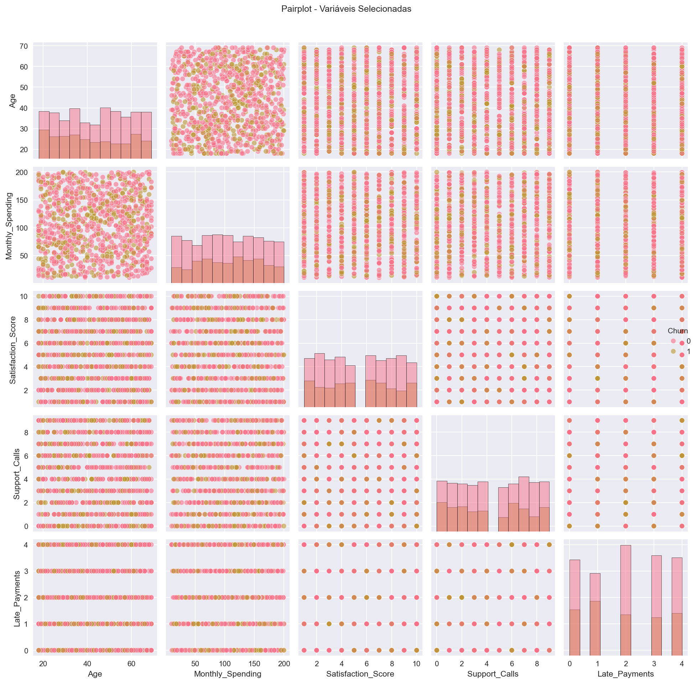

# Dataset Explanation

A base de dados tabular, conforme já foi dito, conta com 8.000 clientes (linhas) e 17 colunas que descrevem perfil, plano/relacionamento e uso de um serviço por assinatura, como por exemplo SaaS/telecom/streaming. Aqui então, o objetivo é prever churn — se o cliente cancela ou não o serviço.

* **`Churn`** (inteiro binário):

  * **0** = não cancelou
  * **1** = cancelou

## Colunas de identificação

* **`Customer_ID`** (int): identificador único do cliente.

## Features (inputs) e tipos

**Categóricas (nominais)**

* **`Gender`** (objeto): {`Female`, `Male`}.
* **`Location`** (objeto): {`California`, `Florida`, `Illinois`, `New York`, `Texas`}.
* **`Subscription_Type`** (objeto): {`Basic`, `Premium`, `Enterprise`}.
* **`Last_Interaction_Type`** (objeto): {`Negative`, `Neutral`, `Positive`}.

**Categórica binária**

* **`Promo_Opted_In`** (int {0,1}): indica se aderiu a promoções.

**Numéricas (contínuas/discretas)**

* **`Age`** (int): idade; 18–69 (52 valores distintos).
* **`Account_Age_Months`** (int): tempo de conta em meses; 1–59.
* **`Monthly_Spending`** (float): gasto mensal; ≈ 10,09 a 199,94 (contínua).
* **`Total_Usage_Hours`** (int): horas totais de uso; 10–499.
* **`Support_Calls`** (int): número de ligações ao suporte; 0–9.
* **`Late_Payments`** (int): pagamentos em atraso; 0–4.
* **`Streaming_Usage`** (int): uso (unidade de consumo de streaming); 0–99.
* **`Discount_Used`** (int): descontos utilizados (unidade/índice); 0–99.
* **`Satisfaction_Score`** (int, **ordinal**): escore de satisfação; 1–10.
* **`Complaint_Tickets`** (int): chamados de reclamação; 0–4.

## Distribuição dos dados

De modo geral, os dados não apresentam dados faltantes, provavelmente por ser uma competição. Claro que a não existência de dados faltantes diminui a complexidade de preparação dos dados, no entanto, no momento de previsão a dificuldade não é tão impactada por isso.

```python
>>> df.to_pandas().info()

RangeIndex: 8000 entries, 0 to 7999
Data columns (total 17 columns):

 #   Column                 Non-Null Count  Dtype  
---  ------                 --------------  -----  
 0   Customer_ID            8000 non-null   int64  
 1   Age                    8000 non-null   int64  
 2   Gender                 8000 non-null   object 
 3   Location               8000 non-null   object 
 4   Subscription_Type      8000 non-null   object 
 5   Account_Age_Months     8000 non-null   int64  
 6   Monthly_Spending       8000 non-null   float64
 7   Total_Usage_Hours      8000 non-null   int64  
 8   Support_Calls          8000 non-null   int64  
 9   Late_Payments          8000 non-null   int64  
 10  Streaming_Usage        8000 non-null   int64  
 11  Discount_Used          8000 non-null   int64  
 12  Satisfaction_Score     8000 non-null   int64  
 13  Last_Interaction_Type  8000 non-null   object 
 14  Complaint_Tickets      8000 non-null   int64  
 15  Promo_Opted_In         8000 non-null   int64  
 16  Churn                  8000 non-null   int64  
```

Com relação a distribuição dos dados, e esses perante as classes 0 e 1 da variável Churn, é possível observar que o conjunto de treinamento contém a maior parte das observações sendo clientes ainda ativos, isto é, Churn = 0.

<!--  -->
<figure markdown>
  
  <figcaption><strong>Figura 1 — Distribuição do target (Churn)</strong><br><em>Fonte: Produção Autoral</em></figcaption>
</figure>

Analisando agora as variáveis categórias contra a variável target (Churn), pode-se perceber que a distribuição das classes da variável target contém o mesmo padrão para a grande maioria das classes das variáveis categóricas, sendo o mesmo da distribuição geral. Em outras palavras, o dataset apresenta $31,3%$ das observações sendo Churn = 1, e dentre todas as classes das variáveis categórias (Gender, Location, Subscription_Type, Last_Interaction_Type), a classe Churn apresenta a mesma distribuição, ficando próximo de 30% das observações apresentadas. A variável categória que possui maior variabilidade relacionada a distribuição de Churn é Location, que possui algumas classes como Florida e Illinois, com as distribuições de aproximadamente $33%$ e $29%$ respectivamente.

<!--  -->
<figure markdown>
  
  <figcaption><strong>Figura 2 — Churn por variáveis categóricas</strong><br><em>Fonte: Produção Autoral</em></figcaption>
</figure>

Com relação as variáveis numéricas, e distribuição das observações, é possível observar que a distinção entre um indivíduo Churn e outro Não Churn, não afeta de forma relavante nenhuma variável. É possível identificar esse fato, observando onde existe os *spikes* na distribuição dos dados. Analisando os *spikes* entre a classe Churn e Não Churn, é difícil identificar algum padrão divergente entre eles. Ou seja, onde existe uma maior concentração de observações Churn, também existe uma maior concentração de observações Não Churn, sempre nas suas devidas proporções em relação as observações em geral, uma vez que a distribuição de Churn é $66,67$% (1) e $33,33$% (0).

É possível identificar essa distribuição muito parecida para ambas as classes a partir dos boxplots, onde os quartis são muito parecidos em todas as variáveis. A única variável númerica que possui uma maior distinção de distribuição em relação ao Churn é Satisfaction Score, o que faz bastante sentido por possuir uma relação instrínseca com a decisão do consumidor de cancelar ou não a sua assinatura.

<!--  -->
<figure markdown>
  
  <figcaption><strong>Figura 3 — Distribuições numéricas por classe</strong><br><em>Fonte: Produção Autoral</em></figcaption>
</figure>

<!--  -->
<figure markdown>
  
  <figcaption><strong>Figura 4 — Boxplots por Churn</strong><br><em>Fonte: Produção Autoral</em></figcaption>
</figure>

De forma a reafirmar o que os gráfico anteriores confirmaram - não existe nenhuma variável explicitamente impactante na decisão do indivíduo cancelar ou não a sua assinatura - os valores de correlação encontrados entre as variáveis e a variável target são muito pequenos, com o maior de todos sendo contra Discount Used $0.0204$.

<!--  -->
<figure markdown>
  
  <figcaption><strong>Figura 5 — Matriz de correlação</strong><br><em>Fonte: Produção Autoral</em></figcaption>
</figure>


```python

Top 10 correlações com Churn:
Churn                 1.000000
Discount_Used         0.020400
Satisfaction_Score    0.019819
Promo_Opted_In        0.017182
Late_Payments         0.016602
Age                   0.016458
Support_Calls         0.012913
Complaint_Tickets     0.010890
Monthly_Spending      0.009202
```

<!--  -->
<figure markdown>
  
  <figcaption><strong>Figura 6 — Pairplot: variáveis selecionadas × Churn</strong><br><em>Fonte: Produção Autoral</em></figcaption>
</figure>

Por fim, observando a distribuição das variáveis numéricas entre elas mesmas é possível observar que a variável Age não exerce um papel determinante no comportamento de saída, já que tanto Churn quanto Não Churn estão distribuídos de maneira semelhante ao longo das faixas etárias.

Por outro lado, o Monthly Spending mostra um contraste mais relevante: clientes com gastos mais altos tendem a permanecer, enquanto aqueles com consumo menor aparecem em maior proporção entre os Churn. Esse padrão sugere que o nível de engajamento financeiro com o serviço está relacionado à fidelidade.

A variável Satisfaction Score se destaca como um dos fatores mais discriminantes. Clientes que atribuíram notas mais baixas estão concentrados na classe de churn, ao passo que aqueles com níveis elevados de satisfação aparecem predominantemente entre os que permanecem. Em complemento, as Support Calls reforçam esse comportamento: indivíduos que acionaram o atendimento com maior frequência também apresentam maior propensão ao churn, enquanto os clientes que raramente buscaram suporte são em sua maioria fiéis.

Por fim, os Late Payments também revelam uma associação com a saída. Clientes sem histórico de atraso tendem a se manter ativos, ao passo que os que acumularam inadimplências figuram de forma mais destacada na classe de churn. A análise conjunta das variáveis mostra que, embora idade não seja um diferencial, aspectos relacionados à satisfação, relacionamento com o suporte e disciplina de pagamento são determinantes na probabilidade de desligamento, sendo o gasto mensal um fator que reforça ou atenua esses efeitos.